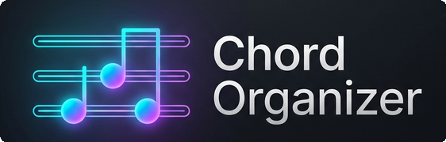

# 🎸 Musician's Zero-Code Guide to Setting Up Chord Organizer

<p align="center">
  
</p>

---

Hey there! 🧑‍🎤 Whether you're a gigging busker, a stage performer, a singer-songwriter, or just someone who loves playing music, **you do not need to be a "tech bro" or a software developer to host your own Chord Organizer.** 

By following this step-by-step guide, you will deploy a private, secure, and beautiful stage-ready library for your chords under **your absolute ownership**—and the best part? It runs entirely on **100% free tiers** with zero monthly subscription fees!

Let's get your stage dashboard up and running in about 15 minutes. ⏱️

---

## 🗺️ What We Are Building
To keep your private data secure, Chord Organizer separates your music dashboard from the background engines that look up chords:
1. **Your Stage Dashboard**: A gorgeous, dark-themed website running on **Google Firebase** where you transpose keys, search songs, and make gig playlists.
2. **The AI Engine (Gemini)**: A free assistant from Google that reads chord sheets and neatly structures them for phone and tablet screens.
3. **The Proxy (Scrape.do)**: A free helper that fetches lyrics and chords from public sites without getting blocked.

---

## 🔑 Step 1: Get a Google AI Studio API Key (Free)
Google provides a free assistant called **Gemini** that cleans up ugly chord sheets, aligns chord symbols directly over lyrics, and tags genres. We need a secure "API Key" to let our app talk to Gemini.

1. Head over to **[Google AI Studio](https://aistudio.google.com/)** and sign in with your normal Google/Gmail account.
2. Click the prominent **"Get API Key"** button (usually in the top-left menu).
3. Click **"Create API Key"** ➔ **"Create API Key in new project"**.
4. Copy the long string of letters and numbers that appears (it starts with `AIzaSy...`). 
5. **Keep this key safe!** Treat it like a password. Paste it temporarily into a blank Notepad document.

> [!IMPORTANT]
> Google's developer free tier allows you to query Gemini thousands of times a day for free, which is more than enough to organize a massive library of thousands of songs!

---

## 🕷️ Step 2: Get a Scrape.do Proxy Token (Free)
Public chord websites like Ultimate Guitar use security blockers (like Cloudflare) to prevent automated scripts from reading pages. **Scrape.do** is a service that safely fetches the chord pages using a residential web browser address so you never get blocked.

1. Go to **[Scrape.do](https://scrape.do/)** and click **"Sign Up"** (no credit card is required, and they have a permanent free plan!).
2. Log in and look at your dashboard. You will see a box labeled **"Your API Token"**.
3. Copy this token (a long string of characters) and save it in your Notepad document next to your Gemini Key.

> [!TIP]
> The Scrape.do free tier gives you **1,000 free successful chord requests every month**. If you fetch 20-30 new songs a week, you will never pay a single penny!

---

## 📂 Step 3: Set up Google Sheets & Apps Script
We use Google Apps Script as a secure "safe vault" to run your web queries without putting your private keys in public browser code.

1. Open your **Google Drive** and create a new **Google Sheet** (Spreadsheet). Call it `My Chords Library`.
2. In the top menu, click **Extensions** ➔ **Apps Script**.
3. You will see a small code editor window with some placeholder text like `function myFunction() {}`.
4. Delete all the existing text in that window so it is completely empty.
5. Open the file **`Code.js`** from this repository (you can view it in your browser or a text editor), select all of its contents, copy it, and paste it directly into the Apps Script editor.
6. Click the **Save** icon (disk symbol at the top).

### 🔒 Store Your Keys Safely:
1. In the Apps Script sidebar on the left, click the **Gear Icon** (Project Settings).
2. Scroll down to the section named **"Script Properties"** and click **"Add script property"**.
3. Configure the following two properties:
   * **Property**: `GEMINI_API_KEY` ➔ **Value**: Your long Gemini API Key from **Step 1** (`AIzaSy...`).
   * **Property**: `APPS_SCRIPT_SECRET` ➔ **Value**: A custom secure token you create (like a strong password, e.g. `MySecureStageSecretToken456!`). This ensures your Web App cannot be accessed publicly!
4. Click **"Save script properties"**.

### ⚡ Publish the Web App:
1. In the top-right corner, click **Deploy** ➔ **New deployment**.
2. Click the gear icon next to "Select type" and choose **Web app**.
3. Fill in the options:
   * **Description**: `Chord Organizer API Gateway`
   * **Execute as**: Choose **Me (your Gmail account)**
   * **Who has access**: Choose **Anyone**
4. Click **Deploy**. Google will ask you to authorize permissions—click "Allow" so the script can read Google docs and fetch web content.
5. Once deployed, you will see a **"Web app URL"** (it looks like `https://script.google.com/macros/s/.../exec`).
6. **Copy this URL!** This is the URL that your stage app will communicate with to request chords.

---

## 🔥 Step 4: Configure Firebase Database & Sign-In
Firebase is a free platform by Google that hosts your frontend stage website and holds your custom chords database.

1. Go to the **[Firebase Console](https://console.firebase.google.com/)** and click **"Add project"**.
2. Call it `valdens-chord-organizer` (or any name you like) and click continue. You can turn off Google Analytics to speed things up.
3. Once your project is ready, click **Build** ➔ **Authentication** in the left menu, then click **"Get Started"**.
4. Under the "Sign-in method" tab, select **Google**, toggle the **Enable** switch, choose your support email, and click **Save**.
5. In the left menu, click **Build** ➔ **Firestore Database**, and click **"Create database"**.
   * Choose your nearest location.
   * Start in **test mode** (or production mode, then deploy the safety rules from `firestore.rules` using the Firebase CLI to lock it down).
   * Click **Create**.

---

## ⚡ Step 5: Put It All Together
Now we just need to let your frontend stage website know how to talk to your new Firebase database and Apps Script gatekeeper!

### 1. Register Your Web App in Firebase:
1. In your Firebase Console, click the **Project Overview** (home icon in top-left).
2. Click the **Web icon** (it looks like `</>` or a small globe) to register a web app.
3. Call it `Chord Dashboard` and check the box for "Also set up Firebase Hosting". Click Register.
4. Firebase will show you a block of code containing a `firebaseConfig` block. It looks like this:
   ```javascript
   const firebaseConfig = {
     apiKey: "...",
     authDomain: "...",
     projectId: "...",
     storageBucket: "...",
     messagingSenderId: "...",
     appId: "..."
   };
   ```
5. Open your local code folder on your computer. Go to the file **`frontend/src/firebase.js`** and open it in a basic text editor (like Notepad or TextEdit).
6. Replace the placeholder values in `firebaseConfig` with your actual keys from the Firebase console.
7. Save and close the file.

### 2. Deploy to the Web!
You can compile and deploy this app directly to Firebase in seconds. If you have the Firebase CLI installed on your computer:
```bash
# 1. Compile the stage dashboard
cd frontend
npm install
npm run build

# 2. Deploy it live!
npx firebase deploy --only hosting,firestore
```

> [!TIP]
> If you don't want to install software on your computer, you can do this entire build step directly inside your web browser! Simply click the **Cloud Shell** icon in the Google Cloud Console, clone your repository, run the two commands above, and your website will be live on a secure HTTPS domain instantly!

---

## 🎸 How to Use Your Private Chord Organizer
1. Open your newly deployed web URL (Firebase will give you a public URL like `https://your-project-id.web.app` when you deploy).
2. Click **Login with Google**.
3. On your first login, the screen will transition into a premium **🔒 Pending Approval** state. This is a built-in safety gate so random strangers cannot abuse your AI quota!
4. **To approve yourself**: Open your **Firestore Database** in the Firebase Console. Look at the `users` collection, find your email, and change your state from `"pending"` to `"admin"`. 
5. Refresh the website—your gorgeous glassmorphic Chord Organizer dashboard is now open!
6. Click **"Add Song"**, paste an Ultimate Guitar URL, and watch the AI engraving animation do all the heavy formatting work for you in real-time.

Happy playing, and rock on! 🎶🎸
